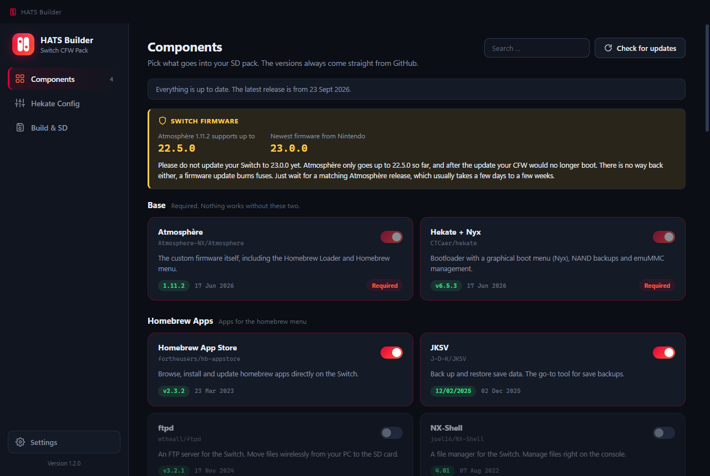
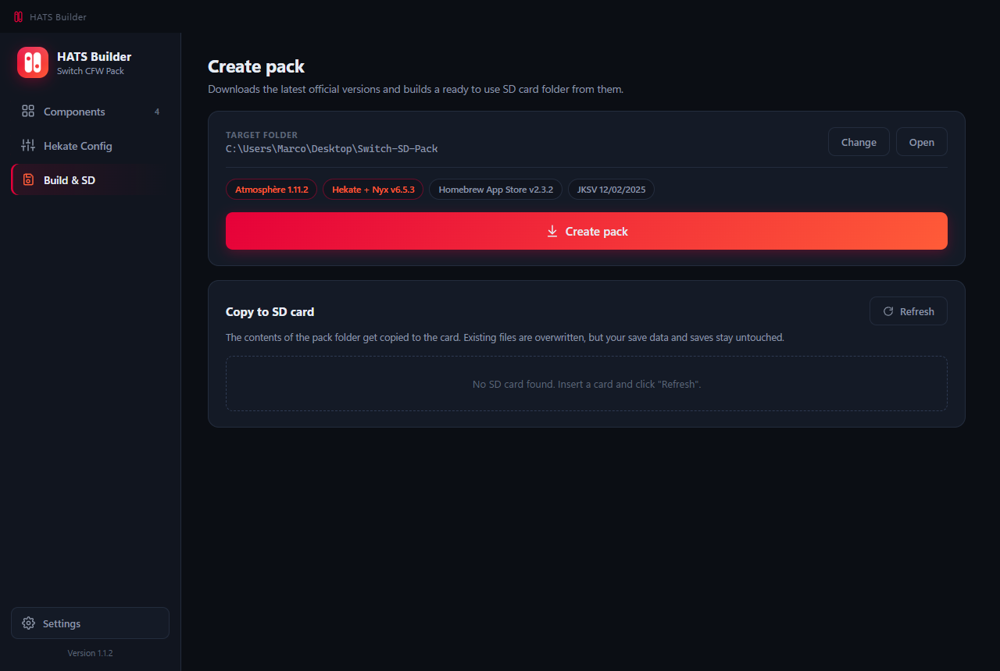

# HATS Builder

| Components | Hekate Config | Build &amp; SD |
|---|---|---|
| [](docs/components.png) | [](docs/hekate-config.png) | [](docs/build-sd.png) |

<details>
<summary><b>🇩🇪 Deutsch</b></summary>

<br>

HATS Builder stellt dir das komplette CFW-Paket für deine gemoddete Switch zusammen. Du klickst an, was drauf soll, und die App holt jede Komponente frisch aus dem offiziellen GitHub-Release ihres Entwicklers. Kein Repack, keine veralteten Dateien, nichts aus zweiter Hand.

Die Oberfläche gibt es auf Deutsch und Englisch, umschalten kannst du sie in den Einstellungen.

### Was dich erwartet

**Komponenten.** Hier stellst du dein Pack zusammen. Über 30 Sachen stehen bereit, von Atmosphère und Hekate über Homebrew-Apps bis zu den Tesla-Overlays. Ein Suchfeld ist da, und wenn du auf eine Versionsnummer klickst, siehst du sofort, was sich im Release geändert hat.

Um Abhängigkeiten musst du dich nicht kümmern. Schaltest du FPSLocker an, kommt SaltyNX von allein mit. Und wo es darauf ankommt, sagt dir die App, womit du es zu tun hast: sys-patch trägt ein Sigpatch-Kennzeichen, weil es Signaturprüfungen umgeht.

**Hekate-Config.** Das Boot-Menü, so wie du es haben willst. Welcher Eintrag automatisch startet, wie lange das Logo stehen bleibt, ob Auto-NoGC an ist. Rechts läuft eine Live-Vorschau der `hekate_ipl.ini` mit, du siehst also beim Klicken, was am Ende auf der Karte landet.

Weiter unten blockst du Nintendos Server per DNS. Für die emuMMC ist das an, für die sysMMC aus. Schaltest du es ab, fragt die App noch einmal nach, denn eine ungeschützte Konsole wird sehr wahrscheinlich gesperrt.

**Erstellen und SD.** Ein Klick, und die App lädt alles herunter und legt dir den fertigen Ordner an. Steckt deine Karte schon im Rechner, kopiert sie ihn auf Wunsch gleich drauf.

Dabei wird zusammengeführt statt plattgemacht: Spielstände, der Nintendo-Ordner und deine emuMMC bleiben, wie sie sind. Vorher schaut die App nach, ob das Pack überhaupt draufpasst, und sagt dir, welche deiner eigenen Konfigurationsdateien sie überschreiben würde. Abbrechen kannst du jederzeit, beim Laden wie beim Kopieren.

### Loslegen

Nimm `HATS Builder.exe`, die ist portabel, ein Doppelklick genügt. Wer es lieber installiert mag, nimmt `HATS Builder Setup.exe`.

Das fertige Pack landet in `Switch-SD-Pack` auf dem Desktop. Suchst du dir selbst einen Ort aus, legt die App auch dort einen eigenen Unterordner an, damit dir nichts zwischen die anderen Dateien rutscht.

Um Updates musst du dich nicht kümmern. Beim Start schaut die App nach, blendet oben einen Balken ein, wenn etwas Neues da ist, und spielt es auf Klick selbst ein. Danach startet sie neu und ist aktuell. Auf GitHub musst du dafür nicht mehr.

### Selbst bauen

```
npm install
npm start        (Entwicklungsmodus)
npm run dist     (EXE bauen)
```

### Gut zu wissen

Deine SD-Karte sollte FAT32 sein. Ist sie exFAT, sagt dir die App Bescheid, denn bei einem Absturz kann exFAT dir die Karte zerlegen.

Ohne Anmeldung erlaubt GitHub 60 Abfragen pro Stunde, und das reicht im Alltag. Wird es dir zu knapp, hinterleg in den Einstellungen ein kostenloses GitHub-Token, dann sind es 5.000. Berechtigungen braucht das Token keine, und es bleibt auf deinem Rechner.

HATS Builder setzt voraus, dass deine Switch schon gemoddet ist, ob per Modchip oder RCM. Die `payload.bin` landet von allein im Wurzelverzeichnis der Karte.

### Ideen und Fehler

Fehlt dir eine Komponente, hast du eine Idee, oder läuft etwas nicht rund? Mach gern ein [Issue auf GitHub](https://github.com/Mitoxe113/HATS-Builder/issues/new) auf, Vorschläge sind ausdrücklich willkommen. Bei einem Fehler hilft es sehr, wenn du kurz dazuschreibst, was du gemacht hast und was stattdessen passiert ist.

</details>

<details>
<summary><b>🇬🇧 English</b></summary>

<br>

HATS Builder puts together the whole CFW pack for your modded Switch. You tick what you want, and the app pulls every component straight from its developer's official GitHub release. No repacks, no stale files, nothing second hand.

The interface comes in German and English, and you can switch it in the settings.

### What you get

**Components.** This is where you put your pack together. Over 30 things are on offer, from Atmosphère and Hekate through homebrew apps to the Tesla overlays. There's a search box, and clicking a version number shows you right away what changed in that release.

Dependencies aren't your problem. Turn on FPSLocker and SaltyNX comes along by itself. And where it matters, the app tells you what you're dealing with: sys-patch carries a sigpatch label, because it bypasses signature checks.

**Hekate Config.** The boot menu, the way you want it. Which entry boots on its own, how long the logo stays up, whether Auto-NoGC is on. A live preview of the `hekate_ipl.ini` runs alongside, so you see what ends up on the card while you click.

Further down you block Nintendo's servers via DNS. It's on for the emuMMC and off for the sysMMC. Switch it off and the app asks you to confirm, because an unprotected console is very likely to get banned.

**Build and SD.** One click and the app downloads everything and builds you the finished folder. If your card is already in the reader, it copies the folder over for you.

It merges rather than wipes: your saves, the Nintendo folder and your emuMMC stay exactly as they are. Before it starts, the app checks the pack actually fits and tells you which of your own config files it would overwrite. You can cancel at any point, while downloading and while copying.

### Getting started

Grab `HATS Builder.exe`, it's portable and a double click is all it takes. If you'd rather install it, run `HATS Builder Setup.exe`.

The finished pack lands in `Switch-SD-Pack` on your desktop. Pick your own spot and the app still creates a subfolder there, so nothing slips in among your other files.

Updates take care of themselves. The app checks on startup, shows a bar at the top when something new is out, and installs it for you at a click. Then it restarts and you're current. No trip to GitHub needed.

### Building it yourself

```
npm install
npm start        (run in dev mode)
npm run dist     (build the EXE)
```

### Worth knowing

Your SD card should be FAT32. If it's exFAT the app says so, because exFAT can wreck a card when something crashes.

Without signing in, GitHub allows 60 requests an hour, which is plenty day to day. If that gets tight, add a free GitHub token in the settings and you get 5,000. The token needs no permissions at all, and it stays on your machine.

HATS Builder assumes your Switch is already modded, whether by modchip or RCM. The `payload.bin` lands in the root of the card on its own.

### Ideas and bugs

Missing a component, got an idea, or did something go wrong? Feel free to open an [issue on GitHub](https://github.com/Mitoxe113/HATS-Builder/issues/new), suggestions are genuinely welcome. For a bug it helps a lot if you add what you did and what happened instead.

</details>
