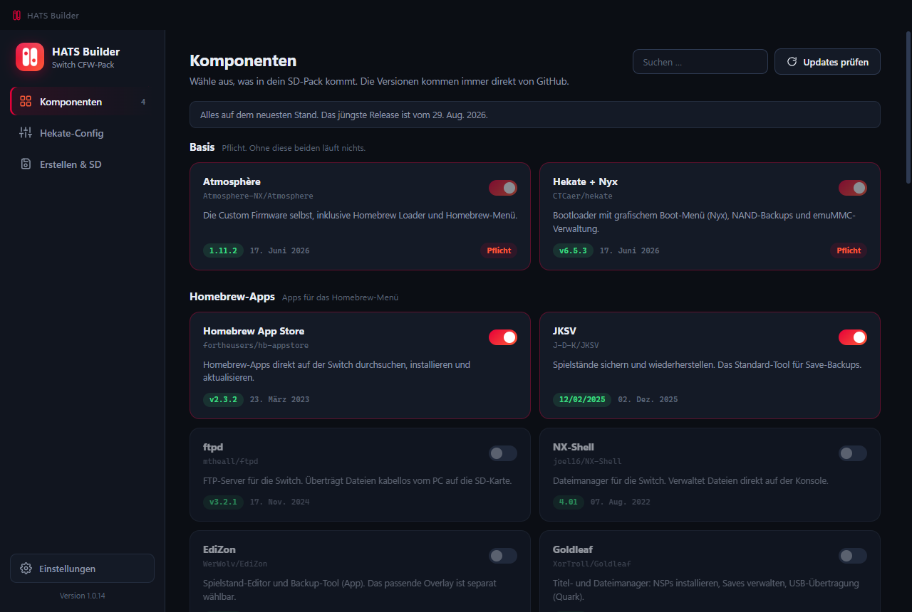
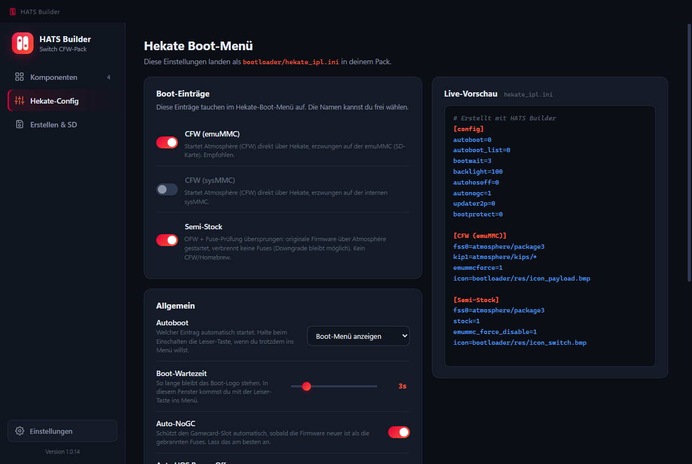

# HATS Builder

| Komponenten | Hekate-Config |
|---|---|
| [](docs/komponenten.png) | [](docs/hekate-config.png) |

<details>
<summary><b>🇩🇪 Deutsch</b></summary>

<br>

HATS Builder ist eine Windows-App, die dir ein komplettes CFW-Paket für deine gemoddete Nintendo Switch zusammenstellt. Alle Komponenten kommen direkt aus den offiziellen GitHub-Releases der jeweiligen Entwickler, immer in der aktuellsten Version. Die Oberfläche gibt es auf Deutsch und Englisch, umschalten kannst du sie in den Einstellungen.

### Was die App kann

Es gibt drei Tabs.

**Komponenten.** Hier wählst du aus, was in dein Pack kommt. Es gibt ein Suchfeld, und ein Klick auf die Version zeigt dir, was sich in dem Release geändert hat. Die App fragt GitHub live ab, du bekommst also immer die neueste Version. Wenn eine Komponente eine andere braucht, aktiviert die App diese einfach mit. FPSLocker braucht zum Beispiel SaltyNX. Ein Eintrag ist gekennzeichnet, damit du weißt, was er ist: sys-patch ist ein Sigpatch, umgeht also Signaturprüfungen.

**Hekate-Config.** Hier richtest du das Boot-Menü ein. Du legst fest, welcher Eintrag automatisch startet, wie lange das Boot-Logo zu sehen ist, ob Auto-NoGC an ist und noch ein paar Dinge mehr. Dazu siehst du eine Live-Vorschau der hekate_ipl.ini, die in dein Pack kommt. In einem eigenen Bereich kannst du Nintendos Server per DNS blocken. Für emuMMC ist das standardmäßig an, für sysMMC aus, und du kannst beides umstellen. Schaltest du die Sperre ab, fragt die App noch einmal nach, denn eine ungeschützte Konsole wird sehr wahrscheinlich gesperrt.

**Erstellen und SD.** Die App lädt die neuesten Versionen in einen eigenen Ordner und kopiert ihn auf Wunsch direkt auf deine Karte. Dabei führt sie alles zusammen, deine Spielstände, der Nintendo-Ordner und die emuMMC bleiben also unangetastet. Vor dem Kopieren prüft sie, ob das Pack überhaupt draufpasst, und sagt dir, welche deiner eigenen Konfigurationsdateien überschrieben würden. Sowohl das Erstellen als auch das Kopieren lässt sich jederzeit abbrechen.

### Starten

Nimm `HATS Builder.exe` (die ist portabel, einfach doppelklicken) oder führe den Installer `HATS Builder Setup.exe` aus. Die App legt sich den Ordner `Switch-SD-Pack` auf dem Desktop an. Wählst du selbst einen Ort wie den Desktop oder die Dokumente, entsteht dort ebenfalls ein eigener Unterordner, damit nichts zwischen deine anderen Dateien gerät.

Die App hält sich selbst aktuell. Beim Start schaut sie nach, ob es etwas Neueres gibt, und blendet dann oben einen Balken ein. Ein Klick lädt die passende Datei, danach startet sich die App neu und ist auf dem neuen Stand. Auf GitHub musst du dafür nicht mehr. Die Prüfung kannst du auch jederzeit in den Einstellungen anstoßen.

### Selbst bauen

```
npm install
npm start        (Entwicklungsmodus)
npm run dist     (EXE bauen)
```

### Hinweise

Deine SD-Karte sollte FAT32 sein, bei exFAT warnt dich die App. Wenn du in den Einstellungen ein kostenloses GitHub-Token hinterlegst, steigt das API-Limit von 60 auf 5.000 Abfragen pro Stunde. HATS Builder ist für eine bereits gemoddete Switch gedacht, egal ob per Modchip oder RCM, und die `payload.bin` landet von allein im SD-Root.

### Vorschläge und Fehler

Dir fehlt eine Komponente, du hast eine Idee für eine Funktion oder etwas läuft nicht rund? Mach gern ein [Issue auf GitHub](https://github.com/Mitoxe113/HATS-Builder/issues/new) auf. Vorschläge sind ausdrücklich willkommen, und bei einem Fehler hilft es sehr, wenn du dazuschreibst, was du gemacht hast und was stattdessen passiert ist.

</details>

<details>
<summary><b>🇬🇧 English</b></summary>

<br>

HATS Builder is a Windows app that builds a complete CFW pack for your modded Nintendo Switch. Every component comes straight from its developer's official GitHub releases, always in the newest version. The interface comes in German and English, and you can switch it in the settings.

### What the app does

There are three tabs.

**Components.** Here you pick what goes into your pack. There's a search box, and clicking a version shows you what changed in that release. The app checks GitHub live, so you always get the latest version of each item. When something needs another component, the app simply enables that one for you. FPSLocker needs SaltyNX, for example. One entry is marked so you know what it is: sys-patch is a sigpatch, which means it bypasses signature checks.

**Hekate Config.** This is where you set up the boot menu. You decide which entry boots automatically, how long the boot logo stays on screen, whether Auto-NoGC is on, and a few more things. You also get a live preview of the hekate_ipl.ini that ends up in your pack. There is a separate section for blocking Nintendo's servers via DNS. It is on for emuMMC and off for sysMMC by default, and you can flip both. If you switch the block off, the app asks you to confirm, because an unprotected console is very likely to get banned.

**Build and SD.** The app downloads the latest versions into a folder of its own and copies it straight onto your card if you want. It merges everything, so your saves, the Nintendo folder and your emuMMC stay untouched. Before copying it checks that the pack actually fits and tells you which of your own config files would be overwritten. Both the build and the copy can be cancelled at any time.

### Running it

Grab `HATS Builder.exe` (it's portable, just double click it) or run the installer `HATS Builder Setup.exe`. The app creates a `Switch-SD-Pack` folder on your desktop. If you pick a place like the desktop or your documents yourself, it creates a subfolder there too, so nothing ends up among your other files.

The app keeps itself up to date. On startup it checks whether something newer is out and shows a bar at the top. One click downloads the right file, then the app restarts itself on the new version. No trip to GitHub needed. You can also trigger the check yourself in the settings.

### Building it yourself

```
npm install
npm start        (run in dev mode)
npm run dist     (build the EXE)
```

### Notes

Your SD card should be FAT32, and the app warns you if it's exFAT. If you add a free GitHub token in the settings, the API limit jumps from 60 to 5,000 requests per hour. HATS Builder is meant for a Switch that's already modded, whether by modchip or RCM, and the `payload.bin` lands in the SD root on its own.

### Suggestions and bugs

Missing a component, got an idea for a feature, or did something go wrong? Feel free to open an [issue on GitHub](https://github.com/Mitoxe113/HATS-Builder/issues/new). Suggestions are genuinely welcome, and for a bug it helps a lot if you add what you did and what happened instead.

</details>
